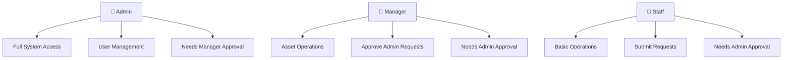
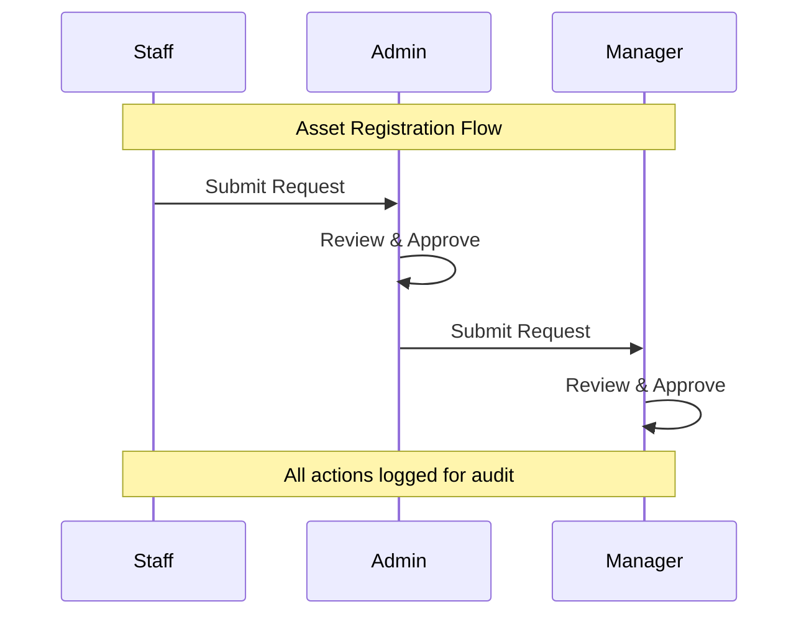

<div align="center">

# 🏢 Asset Management System (AMBP)

[](https://ambp.onrender.com)
[](https://github.com/hafidzduddin88/asset_management)
[](https://github.com/hafidzduddin88/asset_management/pkgs/container/ambp)

**Modern web-based asset management with role-based authentication & approval workflows**

*Created by Asset Management & Business Process Department*

</div>

---

## ✨ Features

<table>
<tr>
<td width="50%">

### 🎯 Core Features
- 📝 **Asset Management** - Add/Edit/Relocate with direct action buttons
- 🔧 **Asset Issues** - Damage/Lost/Disposal via dedicated pages
- 🛠️ **Asset Repair** - Separate repair workflow for damaged assets
- 💰 **Asset Depreciation** - SuperAdmin value recalculation
- 👥 **Role-based Auth** - Admin/Manager/Staff with JWT
- 🔐 **Forgot Password** - Email-based password recovery with secure token
- ✅ **Approval Workflows** - Hierarchical approvals
- 👤 **User Management** - Business unit integration

</td>
<td width="50%">

### 🚀 Advanced Features
- 📱 **PWA Support** - Offline-ready with install prompts
- 📊 **Export Reports** - Excel with optimized column ordering
- 📈 **Dashboard Analytics** - Monthly/Quarterly/Yearly charts
- 🔗 **Google Drive** - Asset photo storage with zoom view
- 📋 **Audit Trail** - Comprehensive logging system
- 🎨 **Direct Actions** - Clean UI with dedicated view pages
- 💱 **Rupiah Format** - Local currency display throughout

</td>
</tr>
</table>

---

## 🛠️ Tech Stack

<div align="center">

### Backend (11 Optimized Packages)


### Frontend


### DevOps


</div>

---

## 🚀 Quick Start

<details>
<summary><b>🔧 Local Development</b></summary>

```bash
# 1. Clone repository
git clone https://github.com/hafidzduddin88/asset_management.git
cd asset_management

# 2. Setup environment
python -m venv venv
source venv/bin/activate  # Windows: venv\Scripts\activate
pip install -r requirements.txt

# 3. Configure environment
cp .env.example .env
# Edit .env with your credentials

# 4. Run application
uvicorn app.main:app --reload --host 0.0.0.0 --port 8000
```

</details>

<details>
<summary><b>🐳 Docker Deployment</b></summary>

```bash
# Quick run with Docker
docker run -p 8000:8000 --env-file .env ghcr.io/hafidzduddin88/ambp:latest

# Or build locally
docker build -t ambp .
docker run -p 8000:8000 --env-file .env ambp

# Optimized for production
docker run -p 8000:8000 --env-file .env -e PYTHONUNBUFFERED=1 -e PYTHONDONTWRITEBYTECODE=1 ghcr.io/hafidzduddin88/ambp:latest
```

</details>

<details>
<summary><b>☁️ Production Deployment</b></summary>

**Automated via GitHub Actions:**
1. Push to `main` branch
2. Docker image built & pushed to GHCR
3. Render.com auto-deploys latest image

**Manual Render Setup:**
- Service: Web Service
- Image: `ghcr.io/hafidzduddin88/ambp:latest`
- Auto-deploy: Enabled

</details>

---

## ⚙️ Environment Variables

<table>
<tr>
<th>Variable</th>
<th>Description</th>
<th>Required</th>
</tr>
<tr>
<td><code>SUPABASE_URL</code></td>
<td>Supabase project URL</td>
<td>✅</td>
</tr>
<tr>
<td><code>SUPABASE_ANON_KEY</code></td>
<td>Supabase anonymous key</td>
<td>✅</td>
</tr>
<tr>
<td><code>SUPABASE_SERVICE_KEY</code></td>
<td>Supabase service role key</td>
<td>✅</td>
</tr>
<tr>
<td><code>GOOGLE_CREDS_JSON</code></td>
<td>Google Service Account credentials (for Drive)</td>
<td>✅</td>
</tr>
<tr>
<td><code>DRIVE_FOLDER_ID</code></td>
<td>Google Drive folder ID for asset photos</td>
<td>❌</td>
</tr>
<tr>
<td><code>DRIVE_SHARED_ID</code></td>
<td>Google Drive shared drive ID</td>
<td>❌</td>
</tr>
<tr>
<td><code>PORT</code></td>
<td>Application port (default: 8000)</td>
<td>❌</td>
</tr>
</table>

---

## 👥 User Roles & Permissions

<div align="center">


```mermaid
graph TD
    A[👑 Admin] --> B[Full System Access]
    A --> C[User Management]
    A --> D[Needs Manager Approval]
    
    E[👔 Manager] --> F[Asset Operations]
    E --> G[Approve Admin Requests]
    E --> H[Needs Admin Approval]
    
    I[👤 Staff] --> J[Basic Operations]
    I --> K[Submit Requests]
    I --> L[Needs Admin Approval]
```

</div>

| Role | Permissions | Approval Required |
|------|-------------|-------------------|
| **👑 Admin** | Full system access, User management | Manager approval |
| **👔 Manager** | Asset operations, Approve admin requests | Admin approval |
| **👤 Staff** | Basic operations, Submit requests | Admin approval |

---

## 🔄 Approval Workflows

<div align="center">


```mermaid
sequenceDiagram
    participant S as Staff
    participant A as Admin
    participant M as Manager
    
    Note over S,M: Asset Registration Flow
    
    S->>A: Submit Request
    A->>A: Review & Approve
    
    A->>M: Submit Request
    M->>M: Review & Approve
    
    Note over S,M: All actions logged for audit
```

</div>

---

## 📁 Project Structure

<details>
<summary><b>📂 View Project Structure</b></summary>

```
asset_management/
├── 📁 .amazonq/rules/       # Amazon Q AI guidance
├── 📁 app/
│   ├── 📁 middleware/        # JWT session authentication
│   ├── 📁 routes/           # API endpoints (13+ modules)
│   │   ├── 📄 asset_management.py  # CRUD operations with view pages
│   │   ├── 📄 damage.py            # Asset issues (damage/lost/disposal)
│   │   ├── 📄 repair.py            # Asset repair workflow
│   │   ├── 📄 depreciation.py      # SuperAdmin depreciation updates
│   │   ├── 📄 approvals.py         # Hierarchical approval system
│   │   ├── 📄 export.py            # Excel export with optimized ordering
│   │   ├── 📄 home.py              # Dashboard analytics
│   │   ├── 📄 forgot_password.py   # Email-based password recovery
│   │   └── 📄 user_management.py   # Business unit integration
│   ├── 📁 static/           # CSS, JS, PWA files
│   ├── 📁 templates/        # Dual template system
│   │   ├── 📁 templates_desktop/   # Full-featured desktop UI
│   │   └── 📁 templates_mobile/    # Optimized mobile UI
│   ├── 📁 utils/           # Core utilities
│   │   ├── 📄 database_manager.py  # Supabase operations
│   │   ├── 📄 auth.py              # Profile protection
│   │   ├── 📄 device_detector.py   # Template routing
│   │   └── 📄 photo.py             # Google Drive integration
│   ├── 📄 config.py        # Environment configuration
│   └── 📄 main.py          # FastAPI application
├── 📁 .github/workflows/   # Automated CI/CD
├── 📄 Dockerfile          # Optimized container
├── 📄 requirements.txt    # 11 essential packages
└── 📄 render.yaml         # Production deployment
```

</details>

---

## 🔗 System Architecture

<table>
<tr>
<td width="50%" align="center">

### 🗄️ Supabase PostgreSQL
- **Primary Database**: Assets, users, approvals
- **Foreign Key Relationships**: Data integrity
- **Log Tables**: Complete audit trail
- **JWT Authentication**: Secure session management
- **Profile Protection**: Prevents data overwrites
- **Business Unit Integration**: Organizational structure

</td>
<td width="50%" align="center">

### 🎯 Core Workflows
- **Asset Management**: Direct action buttons with dedicated view pages
- **Asset Issues**: Separate pages for Damage/Lost/Disposal requests
- **Asset Repair**: Dedicated workflow for damaged assets
- **Asset Depreciation**: SuperAdmin value recalculation system
- **Forgot Password**: Email recovery with token verification & session validation
- **Approval System**: Hierarchical Admin ↔ Manager with notes column
- **Export System**: Excel with optimized column ordering
- **Dashboard Analytics**: Monthly/Quarterly/Yearly charts

</td>
</tr>
</table>

---

## ⚡ Performance Optimizations

<div align="center">

### 🚀 Deployment Speed
- **Minimal Dependencies**: Reduced from 25+ to 11 essential packages
- **Optimized Requirements**: Removed unused SQLAlchemy, PIL, pandas, numpy
- **Single Worker**: Faster startup with `--workers 1`
- **Disabled Logs**: `--access-log false` for production
- **Build Cache**: Skip builds when no changes detected

### 🔐 Authentication & Security
- **JWT Session Management**: Secure token-based authentication with auto-refresh
- **Forgot Password Flow**: 
  - Email-based recovery via Supabase Auth API
  - Secure one-time token verification (token_hash)
  - Session-based password reset with cookie validation
  - Rate limiting protection (429 handling)
  - Fragment URL handling for email links
- **Profile Protection**: Prevents data overwrites during token refresh
- **Role-based Access**: Admin/Manager/Staff with hierarchical permissions
- **Secure Password Storage**: Supabase Auth with bcrypt encryption

### 🗄️ Database Architecture
- **Supabase PostgreSQL**: Primary database with foreign key relationships
- **Direct Queries**: Simplified database operations
- **Log Tables**: Comprehensive audit trail (damage_log, repair_log, etc.)
- **Smart Caching**: Reference data caching with 10s TTL
- **Profile Protection**: Prevents data overwrites during token refresh

### 🎨 UI/UX Enhancements
- **Direct Action Buttons**: Clean interface replacing dropdown menus
- **Dedicated View Pages**: Comprehensive asset detail pages with image zoom
- **Modal Cleanup**: Removed unused components for cleaner codebase
- **Dual Templates**: Separate desktop and mobile optimized layouts
- **PWA Features**: Install prompts and offline capability
- **Rupiah Currency**: Local currency format throughout application
- **Admin-only Edit**: Role-based UI restrictions for better security

### 📦 Docker Optimization
- **Multi-stage Build**: Smaller final image
- **Production Config**: `render.yaml` with optimized settings
- **Exclusions**: `.slugignore` to skip unnecessary files
- **Region**: Singapore deployment for better latency

</div>

---

## 🤝 Contributing

<div align="center">

[](https://github.com/hafidzduddin88/asset_management/graphs/contributors)
[](https://github.com/hafidzduddin88/asset_management/issues)
[](https://github.com/hafidzduddin88/asset_management/pulls)

</div>

1. 🍴 Fork the repository
2. 🌿 Create feature branch (`git checkout -b feature/amazing-feature`)
3. 💾 Commit changes (`git commit -m 'Add amazing feature'`)
4. 📤 Push to branch (`git push origin feature/amazing-feature`)
5. 🔄 Open Pull Request

---

## 📞 Support

<div align="center">

**Need help?** Contact the Asset Management & Business Process Department

[](mailto:support@company.com)
[](https://github.com/hafidzduddin88/asset_management/wiki)

</div>

---

## 📄 License

<div align="center">

[](LICENSE)

**MIT License** - See [LICENSE](LICENSE) file for details

</div>

---

<div align="center">

### 🌟 Star this project if you find it helpful!

[](https://github.com/hafidzduddin88/asset_management/stargazers)
[](https://github.com/hafidzduddin88/asset_management/network/members)

**Made with ❤️ by Asset Management & Business Process Department**

</div>