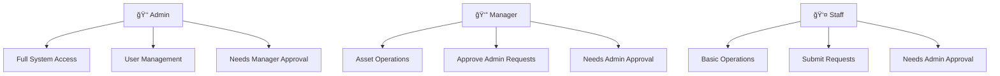

<div align="center">

# 🏢 Asset Management System (AMBP)

[](https://ambp.onrender.com)
[](https://github.com/hafidzduddin88/asset_management)
[](https://github.com/hafidzduddin88/asset_management/pkgs/container/ambp)

**Modern web-based asset management with role-based authentication & approval workflows**

*Created by Asset Management & Business Process Department*

</div>

---

## ✨ Features

<table>
<tr>
<td width="50%">

### 🎯 Core Features
- 📝 **Asset Registration** - Add/Edit/Relocate/Dispose
- 👥 **Role-based Auth** - Admin/Manager/Staff
- ✅ **Approval Workflows** - Hierarchical approvals
- 🔧 **Issue Management** - Damage/Lost reporting
- 👤 **User Management** - Admin controls

</td>
<td width="50%">

### 🚀 Advanced Features
- 📱 **PWA Support** - Offline-ready mobile app
- 📊 **Export Reports** - Excel & PDF generation
- 🔗 **Google Integration** - Sheets & Drive API
- 📋 **Audit Trail** - Complete action logging
- 🎨 **Modern UI** - Card-style responsive design

</td>
</tr>
</table>

---

## 🛠️ Tech Stack

<div align="center">

### Backend


### Frontend


### DevOps


</div>

---

## 🚀 Quick Start

<details>
<summary><b>🔧 Local Development</b></summary>

```bash
# 1. Clone repository
git clone https://github.com/hafidzduddin88/asset_management.git
cd asset_management

# 2. Setup environment
python -m venv venv
source venv/bin/activate  # Windows: venv\Scripts\activate
pip install -r requirements.txt

# 3. Configure environment
cp .env.example .env
# Edit .env with your credentials

# 4. Run application
uvicorn app.main:app --reload --host 0.0.0.0 --port 8000
```

</details>

<details>
<summary><b>🐳 Docker Deployment</b></summary>

```bash
# Quick run with Docker
docker run -p 8000:8000 --env-file .env ghcr.io/hafidzduddin88/ambp:latest

# Or build locally
docker build -t ambp .
docker run -p 8000:8000 --env-file .env ambp

# Optimized for production
docker run -p 8000:8000 --env-file .env -e PYTHONUNBUFFERED=1 -e PYTHONDONTWRITEBYTECODE=1 ghcr.io/hafidzduddin88/ambp:latest
```

</details>

<details>
<summary><b>☁️ Production Deployment</b></summary>

**Automated via GitHub Actions:**
1. Push to `main` branch
2. Docker image built & pushed to GHCR
3. Render.com auto-deploys latest image

**Manual Render Setup:**
- Service: Web Service
- Image: `ghcr.io/hafidzduddin88/ambp:latest`
- Auto-deploy: Enabled

</details>

---

## ⚙️ Environment Variables

<table>
<tr>
<th>Variable</th>
<th>Description</th>
<th>Required</th>
</tr>
<tr>
<td><code>SUPABASE_URL</code></td>
<td>Supabase project URL</td>
<td>✅</td>
</tr>
<tr>
<td><code>SUPABASE_ANON_KEY</code></td>
<td>Supabase anonymous key</td>
<td>✅</td>
</tr>
<tr>
<td><code>SUPABASE_SERVICE_KEY</code></td>
<td>Supabase service role key</td>
<td>✅</td>
</tr>
<tr>
<td><code>GOOGLE_CREDS_JSON</code></td>
<td>Google Service Account credentials (for Drive)</td>
<td>✅</td>
</tr>
<tr>
<td><code>DRIVE_FOLDER_ID</code></td>
<td>Google Drive folder ID for asset photos</td>
<td>❌</td>
</tr>
<tr>
<td><code>DRIVE_SHARED_ID</code></td>
<td>Google Drive shared drive ID</td>
<td>❌</td>
</tr>
<tr>
<td><code>PORT</code></td>
<td>Application port (default: 8000)</td>
<td>❌</td>
</tr>
</table>

---

## 👥 User Roles & Permissions

<div align="center">



</div>

| Role | Permissions | Approval Required |
|------|-------------|-------------------|
| **👑 Admin** | Full system access, User management | Manager approval |
| **👔 Manager** | Asset operations, Approve admin requests | Admin approval |
| **👤 Staff** | Basic operations, Submit requests | Admin approval |

---

## 🔄 Approval Workflows

<div align="center">


</div>

---

## 📁 Project Structure

<details>
<summary><b>📂 View Project Structure</b></summary>

```
asset_management/
├── 📁 app/
│   ├── 📁 database/          # Database models & connections
│   ├── 📁 middleware/        # Authentication middleware
│   ├── 📁 routes/           # API endpoints
│   │   ├── 📄 asset_management.py
│   │   ├── 📄 user_management.py
│   │   ├── 📄 damage.py
│   │   └── 📄 approvals.py
│   ├── 📁 static/           # CSS, JS, images
│   ├── 📁 templates/        # HTML templates
│   ├── 📁 utils/           # Utility functions
│   │   ├── 📄 sheets.py    # Google Sheets integration
│   │   ├── 📄 auth.py      # Authentication
│   │   └── 📄 photo.py     # Image processing
│   ├── 📄 config.py        # Configuration
│   └── 📄 main.py          # FastAPI entry point
├── 📁 .github/workflows/   # CI/CD pipeline
├── 📄 Dockerfile          # Container config
├── 📄 requirements.txt    # Dependencies
└── 📄 render.yaml         # Deployment config
```

</details>

---

## 🔗 API Integration

<table>
<tr>
<td width="50%" align="center">

### 🗄️ Supabase
- Primary database
- User authentication
- Real-time features
- Row-level security
- Asset & reference data

</td>
<td width="50%" align="center">

### 📁 Google Drive
- Photo storage
- Organized folders
- Public previews
- Asset images

</td>
</tr>
</table>

---

## ⚡ Performance Optimizations

<div align="center">

### 🚀 Deployment Speed
- **Minimal Dependencies**: Reduced from 25+ to 8 essential packages
- **Optimized Requirements**: Removed unused SQLAlchemy, PIL, pandas, numpy
- **Single Worker**: Faster startup with `--workers 1`
- **Disabled Logs**: `--access-log false` for production
- **Build Cache**: Skip builds when no changes detected

### 🗄️ Database Migration
- **Google Sheets → Supabase**: Complete migration for better performance
- **Direct Queries**: Simplified database queries without complex joins
- **Caching**: Smart caching for reference data
- **Connection Pooling**: Optimized Supabase client

### 📦 Docker Optimization
- **Multi-stage Build**: Smaller final image
- **Production Config**: `render.yaml` with optimized settings
- **Exclusions**: `.slugignore` to skip unnecessary files
- **Region**: Singapore deployment for better latency

</div>

---

## 🤝 Contributing

<div align="center">

[](https://github.com/hafidzduddin88/asset_management/graphs/contributors)
[](https://github.com/hafidzduddin88/asset_management/issues)
[](https://github.com/hafidzduddin88/asset_management/pulls)

</div>

1. 🍴 Fork the repository
2. 🌿 Create feature branch (`git checkout -b feature/amazing-feature`)
3. 💾 Commit changes (`git commit -m 'Add amazing feature'`)
4. 📤 Push to branch (`git push origin feature/amazing-feature`)
5. 🔄 Open Pull Request

---

## 📞 Support

<div align="center">

**Need help?** Contact the Asset Management & Business Process Department

[](mailto:support@company.com)
[](https://github.com/hafidzduddin88/asset_management/wiki)

</div>

---

## 📄 License

<div align="center">

[](LICENSE)

**MIT License** - See [LICENSE](LICENSE) file for details

</div>

---

<div align="center">

### 🌟 Star this project if you find it helpful!

[](https://github.com/hafidzduddin88/asset_management/stargazers)
[](https://github.com/hafidzduddin88/asset_management/network/members)

**Made with ❤️ by Asset Management & Business Process Department**

</div>